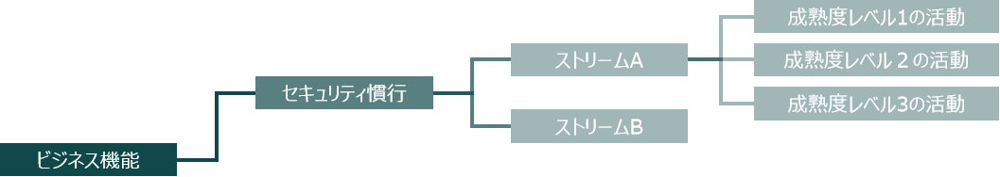
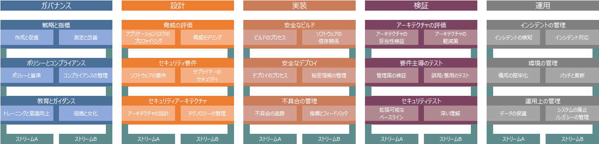

# OWASP SAMM とは?

SAMM は、ソフトウェア保証成熟度モデルの略です。

私たちの使命は、あらゆる種類の組織がソフトウェアセキュリティ体制を分析および改善するための効果的で測定可能な方法を提供することです。私たちは、自己評価モデルを通した安全なソフトウェアを設計、開発、展開する方法について、組織の意識を高め、教育したいと考えています。SAMM は、全面的なソフトウェアライフサイクルをサポートし、テクノロジーやプロセスに依存しません。すべての組織に有効な単一のレシピは存在しないため、本質的に進化的でリスク主導型になるように SAMM を構築しました。

- **測定可能**

	セキュリティ慣行全体で定義された成熟度レベル

- **実行可能**

	成熟度を向上させるための明確な道筋

OWASP SAMM コミュニティは、企業や教育機関のセキュリティに精通したボランティアによって運営されています。グローバルコミュニティは、自由に利用できる記事、方法論、文書、ツール、およびテクノロジーの作成に取り組んでいます。

# OWASP SAMM モデル

SAMM は規範的なモデルであり、使いやすく、全体に定義され、測定可能なオープン フレームワークです。解決策の詳細は、セキュリティ担当者以外でも簡単に理解できます。SAMM は、組織が現時点のソフトウェアセキュリティ慣行を分析し、定義された繰り返しによってセキュリティプログラムを構築し、安全な慣行の漸進的な改善を示し、セキュリティ関連の活動を定義および測定するのに役立ちます。

SAMM は柔軟性を念頭に置いて定義されているため、あらゆるスタイルの開発を使用する小規模、中規模、および大規模な組織がそれをカスタマイズして採用できます。これは、組織がソフトウェア保証に向けてどの段階にあるかを把握し、次のレベルの成熟度に移行するために何が推奨されるかを理解する手段を提供します。

SAMM は、すべての組織がすべてのカテゴリで最大の成熟度を達成することを要求しているわけではありません。各組織は、最適な各セキュリティ慣行の目標成熟度レベルを決定し、利用可能なテンプレートを特定のニーズに適合させることができます。

# OWASP SAMM 構造

SAMM は、5 つのビジネス機能にグループ化された 15 のセキュリティ慣行に基づいています。すべてのセキュリティ慣行には、3 つの成熟度レベルに構造化された一連の活動が含まれています。成熟度レベルが低い活動は、通常、成熟度レベルが高い活動よりも実行が容易であり、形式化も必要ありません。

最高レベルでは、SAMM は 5 個のビジネス機能を定義します。各ビジネス機能は、ソフトウェア開発に関与する組織がある程度実行する必要がある活動のカテゴリのことです。

各ビジネス機能には 3 つのセキュリティ慣行があります。セキュリティ慣行は、関連するビジネス機能に対する保証を構築するセキュリティ関連活動の領域のことです。

セキュリティ慣行には活動があり、論理フローにグループ化され、2 つのストリームに分割されています。ストリームは、慣行のさまざまな側面をカバーし、独自の目標を持っており、さまざまな成熟度レベルで慣行の活動を調整しリンクします。

SAMM では、セキュリティ慣行ごとに 3 つの成熟度レベルを定義しています。各レベルには、特定の活動を伴うより洗練された目標と、より厳密な成功指標があります。

SAMM モデルの構造とセットアップによって、以下がサポートされます。

- 組織の現時点でのソフトウェアセキュリティ体制の評価
- 組織の目標の定義
- 目標に到達するための実装ロードマップの定義
- 特定の活動を実施する方法に関する規範的なアドバイス

# 有用なリンク

- [よくある質問](https://owaspsamm.org/faq)
- [バージョン 1.5 から 2.0 へのマッピング](https://owaspsamm.org/mapping-versions)
- [バージョン 1.5](https://owaspsamm.org/v1-5)
- [頭字語と略語](https://owaspsamm.org/acronyms-and-abbreviations)

